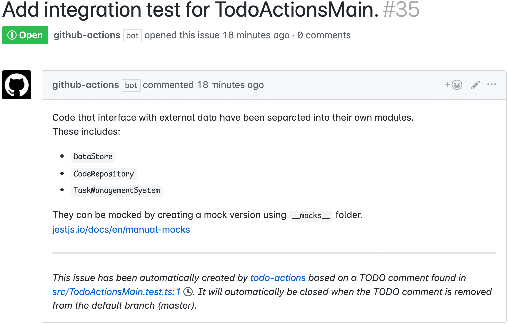
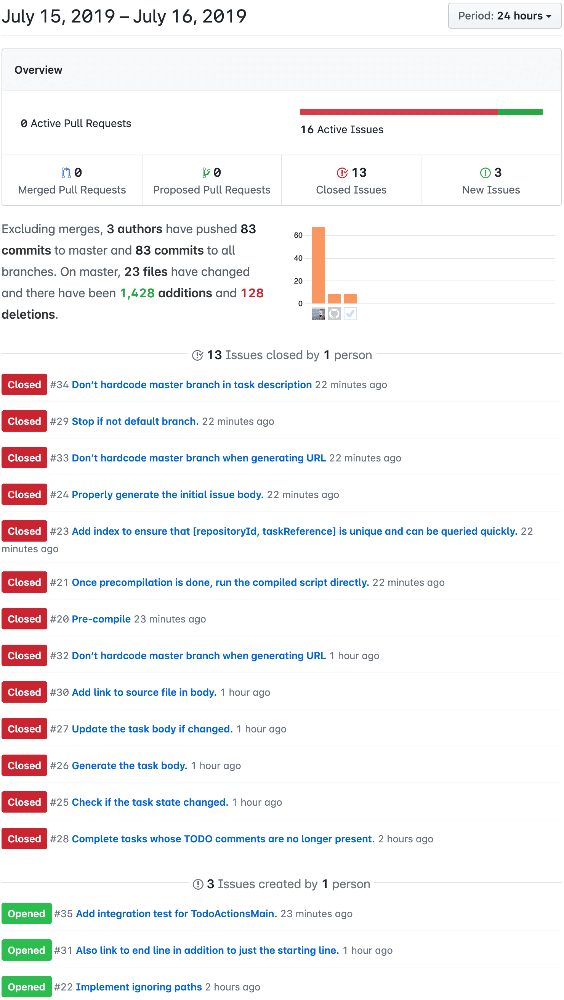
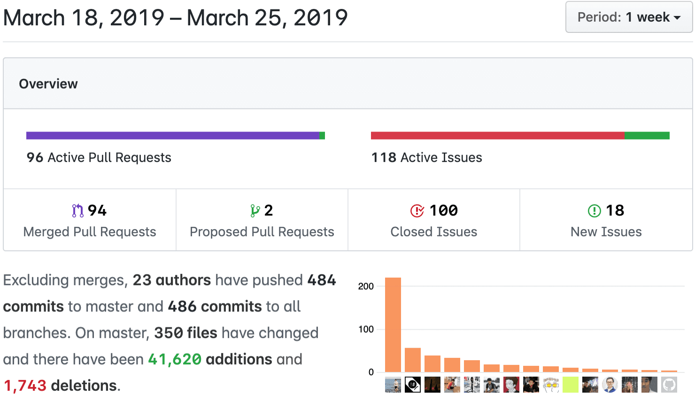

# todo-actions

Turn TODO comments inside source code into GitHub issues and closes them when they are gone. Runs on GitHub Actions. This project is hugely inspired by [0pdd](https://www.yegor256.com/2017/04/05/pdd-in-action.html).

## Features

- Turns TODO comments into GitHub issues.

  A TODO comment looks like this:

  ```js
  // TODO: Add integration test for TodoActionsMain.
  //
  // Code that interface with external data have been separated into their own modules.
  // These includes:
  //
  // - `DataStore`
  // - `CodeRepository`
  // - `TaskManagementSystem`
  //
  // They can be mocked by creating a mock version using `__mocks__` folder.
  // https://jestjs.io/docs/en/manual-mocks
  ```

  …and it gets turned into an issue like this:

  

  The first line is the title. The rest becomes the issue body.

- The GitHub issue is updated whenever the text inside the TODO comment changes.
  This allows elaboration and collaboration on TODO comments.

- Once the TODO comment is removed, the corresponding issue is automatically closed.
  This allows fine-grained task management, and also allows new contributors to easily contribute to the code base.

  

  As a case study, when we [used](https://wonderful.software/elect-live/pdd/) the [0pdd](./docs/images/elect-live-example.png) tool on [codeforthailand/election-live](https://github.com/codeforthailand/election-live) project, it helped us attract 20+ contributors and visualized the work that got done in just 7 days:

  

## Usage

Stay tuned!

## Development

### Glossary

This tool is designed to be task management system-agnostic.
That is, in the future it may be used with tools other than GitHub issues.
Therefore, inside the code base, instead of “issues,” `todo-actions` calls them tasks.

- **TODO comment:** A TODO comment inside the source code.
  It begins with a _TODO marker_, and followed by a block of text whose first line is the title and the rest is the body.

  ```
  // TODO: Title here
  // Body here
  ```

  A TODO comment may be in one of 3 stages:

  - **new:** This TODO comment is newly added.
    To ensure that we can reliably track the TODO comment, even when its title or body changes,
    we need to assign a unique identifier to it.
  - **identified:** This TODO comment has been identified.
    However a _Task_ has not been created for this TODO comment yet.
  - **associated:** A _Task_ has been created for this TODO comment.

- **TODO marker:** The text that denotes a TODO comment.
  It begins with the word `TODO`, may contain a _reference_ inside square brackets, and ends with a colon.
  In order for the marker to be recognized, it must follow a whitespace, and no alphanumeric character may precede it.

  | Stage      | Example marker                      |
  | ---------- | ----------------------------------- |
  | new        | `TODO:`                             |
  | identified | `TODO [$5d20dc8e6a26d44c2afd08c6]:` |
  | associated | `TODO [#1]:`                        |

- **Repository:** A GitHub repository. Don't use the word “project” when you mean “repository.”

- **Task Management System:** e.g. GitHub Issues, GitHub Projects, Trello, Taskworld, JIRA, etc.

- **Task:** A work item inside a _Task Management System_ that can be created and completed by `todo-actions`. e.g. an issue, a card, a ticket, or a task.

  - **To complete a task** means “to close an issue,” “to move a card to done,” or “to mark as completed/resolved,” depending on the task management system you use.

### Implementation overview

1. A `push` event causes the action to run in GitHub Actions. If the current branch is master, it continues. Otherwise, it is aborted.

2. The action scans for `TODO` comments.

   ```
   // TODO: implement this thing
   ```

3. Each new TODO marker is then replaced with a unique ID.

   ```
   // TODO [$5d20dc8e6a26d44c2afd08c6]: implement this thing
   ```

4. The change is committed and pushed to the repository. If the push is successful, then we have successfully uniquely identified each to-do comment. Otherwise, someone else has made another commit to the repository, and the action is aborted.

5. For each `TODO` marker, create a GitHub issue. Then replace the marker with the issue number.

   ```
   // TODO [#1]: implement this thing
   ```

6. The change is committed and pushed to the repository. If the push is successful, then it is done. Otherwise, someone else has made another commit to the repository, the action on that commit will take care of committing.
